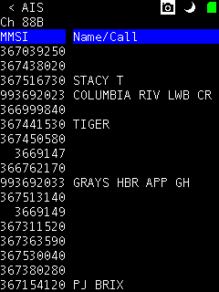
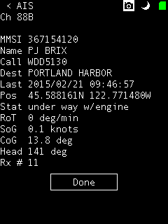
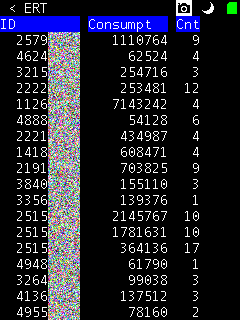
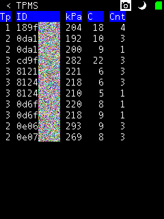

The PortaPack can receive multiple digital modes. At present, three transponder receivers are implemented. These receivers are accessible via the menu path Receiver -> Transponders.

## Transponders

### AIS

[Automatic Identification System (AIS)](https://en.wikipedia.org/wiki/Automatic_Identification_System) is a tracking system used by water-going vessels. It is described in [ITU Recommendation M.1371](http://www.itu.int/rec/R-REC-M.1371/en).

The PortaPack AIS receiver decodes information coming from vessels and base stations, on one of two selectable VHF frequencies, 161.975 MHz (channel 87B) or 162.025 MHz (channel 88B).

The recents view shows two columns, the [Maritime Mobile Service Identity](https://en.wikipedia.org/wiki/Maritime_Mobile_Service_Identity) (MMSI) and the vessel name or call sign, if it was received.



The MMSI detail view shows the most recent details received from the source.



If a FAT-formatted micro SD card is present when this mode is entered, the receiver will log received packets to a file named "AIS.TXT". The log file contains one line per length- and CRC-validated packet received. Each line consists of a timestamp in sortable "YYYYMMDDHHMMSS" format and the decoded packet contents. An example:

```
20150221094726 5200dfff8c6625e385558baee5721ebb80a9fe7e
20150221094727 05577ed298200025cd462c9a5f6c06b2ffae00000046a77e
20150221094727 6157708da00d26535013204d0252254820820820679f7e
20150221094733 0557964ba9600415ce32c11a1e08144effbe00000081487e
20150221094734 1000dff26c7e02ac6c8373f4bb068b07d1c00940aeab517e
20150221094734 56ecea25de419e62a6844830244ad018b85006940b8f0f9034daacc00000003fa0000082607e
```

### ERT

[Encoder Receiver Transmitter (ERT)](https://en.wikipedia.org/wiki/Encoder_receiver_transmitter) is a utility metering system for water, natural gas, and electricity services.

The PortaPack ERT receiver monitors approximately 2.5 MHz centered around 911.6 MHz. It does not implement channel filters, so sensitivity is reduced in exchange for monitoring more simultaneous "channels".



(IDs partially obscured to protect privacy.)

If a FAT-formatted micro SD card is present when this mode is entered, the receiver will log received packets to a file named "ERT.TXT". The log file contains one line per packet received. Each line consists of a timestamp in sortable "YYYYMMDDHHMMSS" format, the Manchester-decoded data bits, a "/", and a per-bit Manchester coding error indicator ("1" if the data bit is in error). An example:

```
# Underscores used to obscure IDs for privacy
20150221100640 440365ff0ff____2814/0000000000000000001
20150221100641 4c0417cc0ff____e1cc/0000000000000000001
20150221100641 4400b1cd0ff____d03c/0000000000000000001
20150221100641 440365ff0ff____2814/0000000000000000001
20150221100641 4c0417cc0ff____e1cc/0000000000000000001
20150221100642 86001495d91____f0be/0000000000000000001
20150221100649 1c5cc604170152____fcbc0200000b080000000000000000000006a33e0402c160905024140a05024120a0502412090582c120905028160a04828160a05824160905824160b05828140a050241209048241200fa10c93f47/00000000000000000000000000000000000000000000000000000000000000000000000000000000000000000000000000000000000000000000000000000000000000000000000000000000000000000000000000000000
```

### TPMS

[Tire Pressure Monitoring System (TPMS)](https://en.wikipedia.org/wiki/Tire-pressure_monitoring_system) monitors automobile tire properties while the vehicle is in operation. It is mandated by law in some countries. No unified standard exists for the signal modulation or encoding. By one industry estimate, there are far in excess of 100 signal and encoding variations.

The PortaPack TPMS receiver decodes the following modulations and encodings:

| Frequency | Modulation | Deviation | Symbol Rate | Sync/Preamble | Encoding | Notes |
| --------- | ---------- | --------- | ----------- | ------------- | -------- | ----- |
| 315.000 MHz | FSK | 38.4 kHz | 19.2 k/sec | 14 x "01", "10" | Manchester | Used by US Ford/Lincoln/Mercury vehicles, perhaps others? |

The recents view shows five columns: a signal/packet type, a transmitter unique ID, tire pressure in kilopascals, tire temperature in Celsius, and a count of packets received from the transmitter. The signal/packet type is arbitrarily defined by me. The tire pressure and temperature are approximate, as I have only indirectly observed and correlated these properties from cars where I live.



(IDs partially obscured to protect privacy.)

If a FAT-formatted micro SD card is present when this mode is entered, the receiver will log received packets to a file named "TPMS.TXT". The log file contains one line per packet received. Each line consists of a timestamp in sortable "YYYYMMDDHHMMSS" format, receiver frequency, modulation, deviation, symbol rate, and data. The data field consists of Manchester-decoded data bits, a "/", and a per-bit Manchester coding error indicator ("1" if the data bit is in error). An example:

```
# Underscores used to obscure IDs for privacy
20150221101356  315000000 FSK 38.4 19.2 c20dee____c0983c279345ab8fe8f304/0000000000000000000053a3e246016a
20150221101356  315000000 FSK 38.4 19.2 c20dee____c0983c27935e5671df8cf8/000000000000000000007ff49d2a98fe
20150221101356  315000000 FSK 38.4 19.2 c20dee____c0983c279351663c544880/0000000000000000000065dc1b5f234b
20150221101901  315000000 FSK 38.4 19.2 189f____994444fac1b526859975d25c/0000000000000000f2baeaf9685ad941
20150221101901  315000000 FSK 38.4 19.2 189f____994444faea26a1ee7f35957b/000000000000004021fd24016a145fb1
20150221101901  315000000 FSK 38.4 19.2 189f____994444fa93788587b6df4b5a/000000000000000016247681ef47d43e
20150221101901  315000000 FSK 38.4 19.2 189f____994444fad5b4b8028c009a68/0000000000000000a5522726eea6d84b
```