The PortaPack boots almost instantly into the top menu. Turn the navigation wheel clockwise or counter-clockwise to change the selected menu item. You may also use the navigation up and down arrow buttons. Press navigation center button ("select") to choose the menu item.

## Status Bar

The status bar is visible at all times, and provides tools and status for general operation.

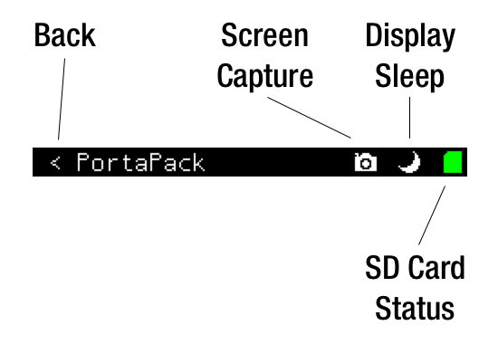

The screen capture button saves a .PNG file named "CAPTURE.PNG" to the micro SD card. It takes about two seconds to create this file, and the screen will freeze during this time. So don't be surprised! Also, the screen capture does not generate unique filenames, so a new screen capture file will overwrite an existing file.

The display sleep button turns off the PortaPack LCD. The PortaPack continues to operate, but reduces power consumption by approximately 300mW (15%) while the display is off. Press the "select" button on the navigation control to wake up the display.

The SD card status icon indicates if the SD card is present and functioning correctly (green), is not present (yellow with "?"), or is experiencing an error (red with "X").

## Receiver

The PortaPack implements several varieties of [audio receiver](Audio Modes) and decodes some [digital transponder](Digital Modes) transmissions.

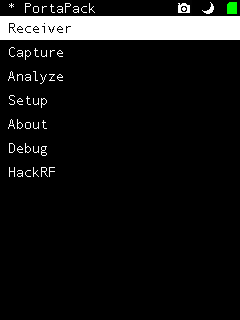

## Setup

PortaPack configuration is done through the "setup" menu:

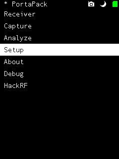

### Date/Time

If your PortaPack is new or you have disconnected the PortaPack from your HackRF, you will need to reset the real-time clock via the "date/time" menu:

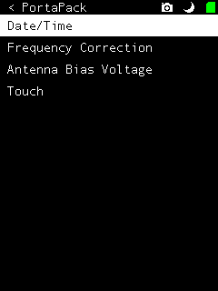
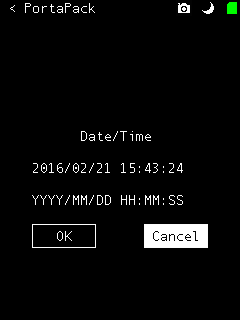

### Frequency Correction

The crystal frequency reference on the HackRF has a typical tolerance of 10 parts per million (ppm). This can cause an offset in the tuning frequency, where a target signal will appear a bit higher or lower than the expected center frequency. You can compensate for this by adjusting the frequency of the clock reference. This is done through the "frequency correction" menu:

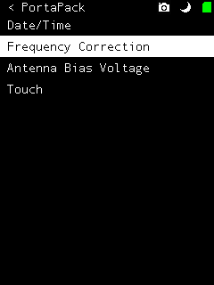
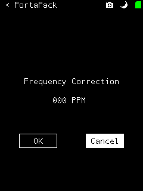

It may be easier to do this through the [receiver mode](https://github.com/sharebrained/portapack-hackrf/wiki/Audio%20Modes), where you can tune a known-accurate signal and adjust the PPM value.

### Antenna Bias Voltage

The HackRF One provides optional antenna bias voltage. Before enabling antenna bias voltage, ensure that everything attached to the HackRF antenna connector can accept a DC bias voltage. If any amplifier, filter, antenna, cable, or other attached hardware has a DC path or can't accept a DC voltage, damage to the equipment or HackRF or USB power supply may result. To enable or disable the antenna bias voltage, use the "antenna bias voltage" menu item:

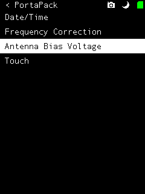
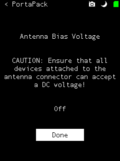

### Touch Calibration

Touch calibration is not yet implemented. Fortunately, the touch screens used in the PortaPack have been pretty consistent in touch screen accuracy. Plus, the current PortaPack design does not rely on touch operation, but only as an augmentation to features also available via the navigation controls.

## About

The "about" view displays details of the PortaPack firmware and bitstreams on the HackRF and PortaPack CPLDs.

The Git repository short commit hash indicates the version of firmware running on the device.

At present, the HackRF and PortaPack CPLD checksums are not calculated. However, at boot time, the PortaPack checks the PortaPack CPLD bitstream and upgrades it if it does not match the expected version.

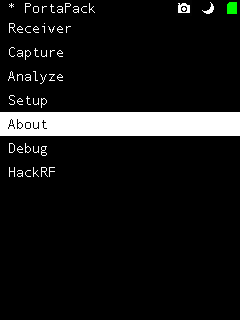
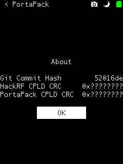

## Debug

Several simple debugging views are available in the debug menu:

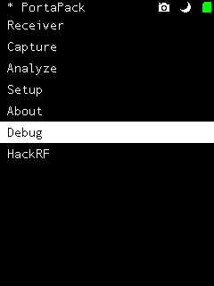

Processor memory, peripherals (various chip registers), and system temperature are currently implemented.

## HackRF

When the PortaPack firmware is running, the HackRF does not respond to a computer over USB. If you would like to use your HackRF One with a computer, you need to reboot the HackRF in "HackRF Mode". You can do this from the "HackRF" option in the top menu:

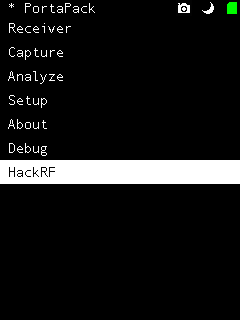
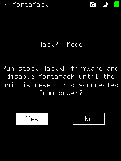

Select "Yes", and the HackRF will restart in HackRF Mode. This process takes less than one second. The HackRF can now interact with a computer over USB. The PortaPack screen will remain dark during HackRF Mode. When you are done with HackRF Mode, press the HackRF reset button or disconnect power from the HackRF.