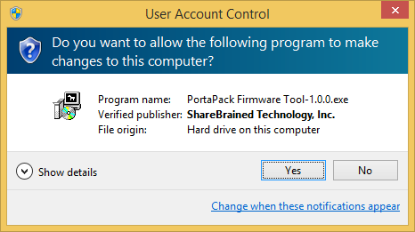
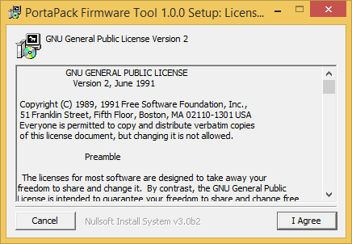
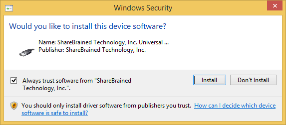
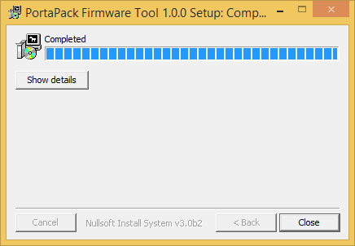
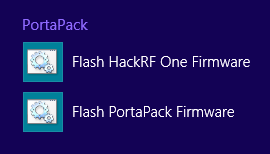
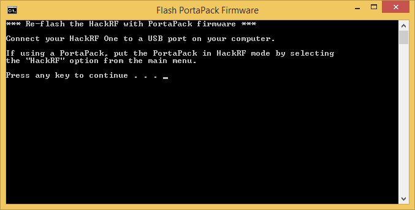

If you're using Windows, use the PortaPack Firmware Tool to put PortaPack firmware into your HackRF One.

Download and run the PortaPack Firmware Tool installer from the latest release on the [project releases page](https://github.com/sharebrained/portapack-hackrf/releases).

Windows SmartScreen may warn you about running this program. If so, tell Windows to run the program anyway.

You will be asked if you want to allow the program to make changes to your computer. Answer "Yes".

You will be asked to accept the GNU General Public License Version 2. Click "I Agree".

You will be asked twice to install device software from ShareBrained Technology. The first is for the HackRF driver, and the second is for the NXP LPC DFU mode driver. Click "Install" both times. Or if you're feeling especially bold, you can check "Always trust software from ShareBrained Technology, Inc.", and Windows will never ask again if you trust ShareBrained Technology.

The installer will finish. Click "Close".

You will now have a "PortaPack" program group with two shortcuts. One will flash the PortaPack firmware onto your HackRF. The other will flash the stock HackRF firmware (with no PortaPack functions).

To install PortaPack firmware on your HackRF, click on the "Flash PortaPack Firmware" shortcut. A DOS prompt will appear on screen. Just follow the instructions!

I don't claim to be a Windows developer, so I'm sure it won't work perfectly for everybody. So if you have any problems or questions, please <a href="mailto:support@sharebrained.com">e-mail me</a>!